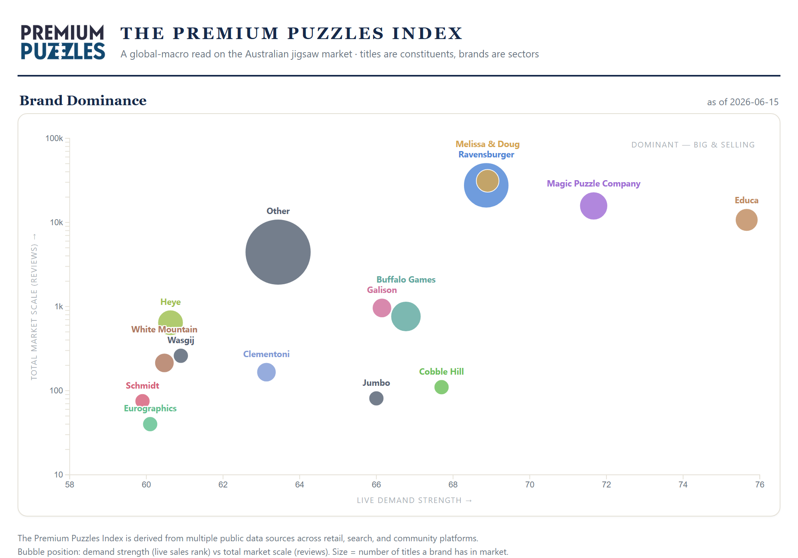
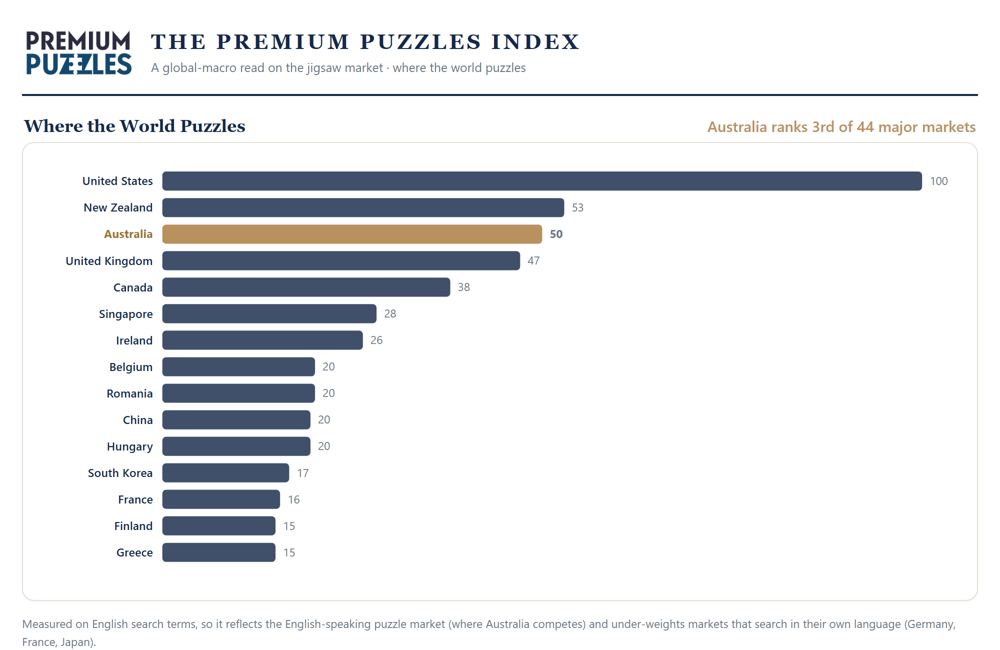

# The Premium Puzzles Index — A Guide

*A plain-language explainer for the Premium Puzzles team. Share freely.*

---

## What it is

The Premium Puzzles Index treats the jigsaw market the way a financial
analyst treats the stock market. Individual puzzles are like company shares,
brands are like industry sectors, and we track real demand signals the way a
trader tracks prices.

The result is a daily, data-driven read on the puzzle market: what is selling,
which brands are winning, and how Australia compares to the rest of the world.
It is intelligence no competitor or supplier has, and it is built entirely
in-house.

## Why it matters for Premium Puzzles

- **Credibility.** It positions Premium Puzzles as the smart, data-led voice in
  the category, not just another store.
- **Marketing fuel.** Every refresh is newsletter and social content. The
  charts are designed to be shared.
- **Buying leverage.** Walking into a supplier conversation with data on what is
  trending in Australia is a genuine negotiating asset.
- **Customer trust.** We never guess. We measure, and we are honest about the
  limits of what we measure.

## What it measures

The Index is built from multiple public data sources across **retail
marketplaces, search platforms, community forums, and secondary-market
sales**. We combine these into a single picture of demand. The specific
weighting method is our own recipe, and that recipe is the valuable part.

We never publish raw source data. Only the finished Index leaves the building.

## The three views

### 1. Brand Dominance — who rules the shelf

Each bubble is a brand. Position to the **right** means it is selling strongly
right now. Position **higher up** means it has a larger overall footprint.
Bubble **size** is how many titles the brand carries. Top-right equals
dominant: big and selling.

Today's read: **Ravensburger owns the Australian shelf**, with the widest range
and strong demand. Melissa & Doug rides high on sheer volume from a few mega
sellers, while Magic Puzzle Company and Educa show the strongest pure demand.

### 2. The Market Map — every title

The same idea, but every individual puzzle plotted, split into four quadrants:
**Dominators** (big and hot), **Fading Giants** (big but cooling),
**Breakouts** (small but surging), and the **Long Tail**. This is where we
spot a puzzle breaking out before the rest of the trade notices.

### 3. Where the World Puzzles — the global view

This ranks countries by puzzle search interest on one comparable scale.

The headline: **Australia is the world's 3rd most puzzle-obsessed major
market**, behind only the United States and New Zealand, and ahead of the UK
and Canada. The entire top tier is the English-speaking world.

## What we have learned so far

- Australia is a genuine global heavyweight in puzzles. Top three among major
  markets.
- New Zealand punches far above its size, sitting second.
- Puzzle demand over-indexes heavily in English-speaking countries.
- Locally, the category's review volume is concentrated: a small number of
  titles account for most of the noise, so this is a hit-driven market.

## The honest caveats (read these before sharing numbers)

Being upfront about limits is what makes us the trustworthy voice, not a
vulnerable one. Always carry these:

1. **The global view tracks English-language search.** It reflects the markets
   we compete in and deliberately under-counts Germany, France and Japan, who
   search for puzzles in their own languages.
2. **It is early.** The Index is days old, so most views are a snapshot, not a
   trend. "Is this rising or falling?" is honestly answered with "ask in a
   month." That growing history is itself a recurring story for the newsletter.
3. **The brand picture is currently category-wide**, so children's puzzles
   inflate some brands. A premium adult-segment cut is on the roadmap.

## How we use it in the newsletter

The charts export as ready-to-send images (email cannot run live charts, so we
use pictures). The suggested launch is a two-week arc:

- **Week 1:** lead with the global view. *"Australia is the world's #3 puzzle
  nation."* It is a complete claim that needs no history.
- **Week 2:** zoom into the local shelf. *"Now, who actually rules the
  Australian market."* By then the local data has another week behind it.

Leading global first, local second, mirrors a big-picture-to-backyard story
and pulls readers forward.

## How it stays current

The Index updates itself daily, with no manual work. Each source is collected
on a sensible rhythm (fast-moving signals daily, slower ones weekly) and the
charts rebuild automatically. The team just picks which image to share.

## What's next (roadmap)

- A premium **adult-segment** cut for a truer brand picture.
- **Trend lines** once we have several weeks of history (rising vs falling
  brands, momentum).
- A live, hosted page that can sit behind a menu on the website.
- Wider title and brand coverage as we learn what readers ask about.

## Where things live

Everything is in the `puzzles` repository.

- This guide: `docs/INDEX_GUIDE.md`
- Ready-to-send images: `web/assets/index_global_newsletter.png` and
  `web/assets/index_newsletter.png`
- The full interactive dashboard: `web/puzzle_index.html` (open in a browser)
- The methodology and design: `docs/INDEX_DESIGN.md`

---

*The Premium Puzzles Index is derived from multiple public data sources across
retail, search, and community platforms.*
